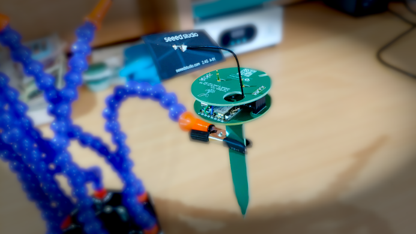
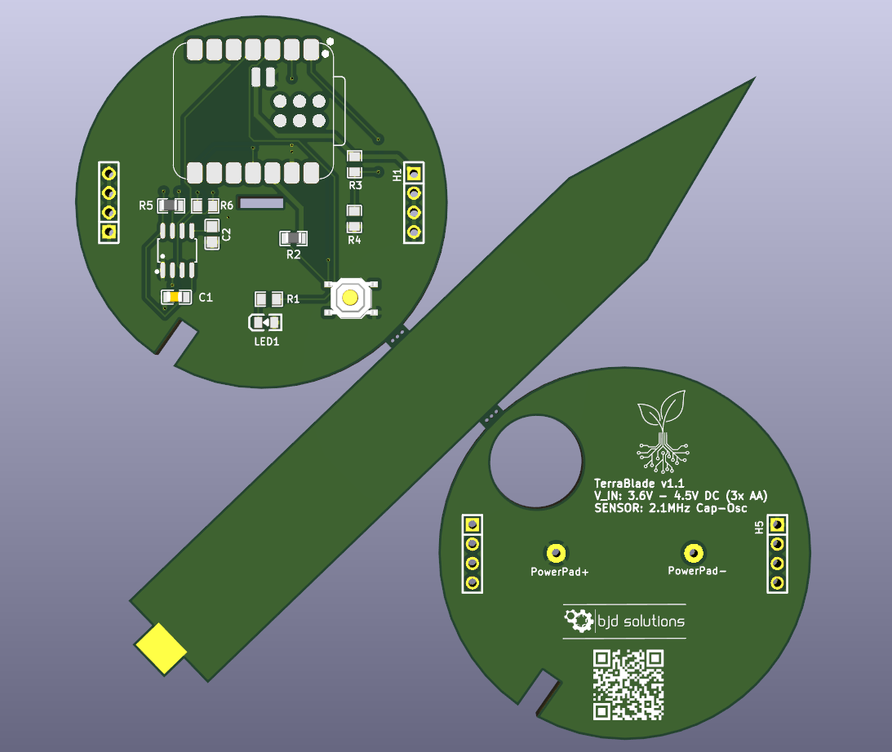
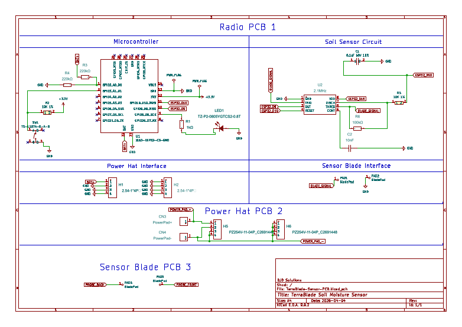

# 🌱 TerraBlade Sensor - Hardware PCB

 

---

**TerraBlade** is a professional-grade, ultra-low-power capacitive soil moisture sensor designed around the Seeed Studio XIAO ESP32-C3. 

This repository contains the complete KiCad 9 hardware design files, manufacturing plots, and mechanical Inkscape references for the PCB assembly. This board is designed using a **"PCBA-Driven"** workflow, meaning the electronics were engineered first, acting as the structural core for a modular 3D-printed enclosure.

Created by [BJD Solutions](https://bj-dehaan-solutions.com.au/).

---

## Key Engineering Features

*   **True Digital Capacitive Sensing:** Ditching the noisy, drifty analog peak-detectors of standard cheap soil sensors. The FR4 PCB blade acts as the timing capacitor for an industrial-grade **TLC555IDR** oscillator. It outputs a raw, clean frequency directly to the ESP32's hardware Pulse Counter (PCNT) for flawless, high-resolution moisture data.
*   **Zero-Leakage "Parasitic" Power:** The 555 timer is powered directly by an ESP32 GPIO pin. The ESP32 wakes up, powers the sensor, takes a reading, and kills the power before going back to sleep. Sensor quiescent current: **0.0µA**.
*   **Panelized 3-in-1 Design:** The **Radio PCB**, **Power Hat**, and **Sensor Blade** are all designed to be manufactured on a single 100x100mm panel connected by mouse-bites to save on fabrication costs.
*   **Mortise & Tenon Assembly:** The Sensor Blade features a custom "tenon" tab that slots perfectly into the main Radio PCB and is soldered directly at a 90-degree angle, requiring zero wires.
*   **Pogo-Pin Power Hat:** Handles the mechanical shear force of a plunging outdoor sensor by using through-hole Pogo Pins (spring-loaded contacts) rather than weak SMD conical springs.
*   **Low-Voltage Optimized:** Features an ultra-efficient 573nm Yellow-Green LED that requires only ~2.0V to light up. It will reliably flash in "Config Mode" even when the 3x AA batteries are nearly dead. Includes a precision 1% 220kΩ voltage divider for highly accurate battery monitoring.

---

## 📂 Repository Structure

*   Full KiCad 9 project files (`.kicad_pro`, `.kicad_sch`, `.kicad_pcb`).
*   Ready-to-order plot files, drill files, and the solder paste stencil map.
*   High-resolution PDF exports of the schematic and PCB layers.
*   Original Inkscape (`.svg`) files used to perfectly calculate the complex `Edge.Cuts` curves, alignment notches, and Mortise & Tenon joints.

---

## 🛠️ Assembly & Manufacturing Notes

If you are ordering these boards from a fabricator please note the following:

1.  **Thickness:** Order in standard **1.6mm FR4**. The Mortise and Tenon slot on the Radio PCB is routed to exactly 1.7mm to provide a perfect slip-fit for 1.6mm thick material.
2.  **Solder Mask is Mandatory:** Do NOT expose the copper on the Sensor Blade. The blade relies on the green Solder Mask to act as a waterproof dielectric barrier. Exposing the copper to wet soil will cause rapid galvanic corrosion and destroy the sensor.
3.  **Keyway Notches:** The Radio PCB and Power Hat feature an 8-o'clock alignment notch. This is an asymmetrical keyway designed to interface with a matching rail in the future 3D-printed enclosure, preventing the board from twisting or being inserted backward.
4.  **Solder Paste Stencil:** The `F.Paste` layer has been custom-tailored to remove paste from the structural Mortise & Tenon joints, allowing for clean, manual fillet soldering without bridging.

---

## 🛒 BOM Highlights (LCSC)

The full [BOM](BOM.csv) is included and can be generated from the KiCad schematic, here are the critical components used in this design:

*   **Microcontroller:** Seeed Studio XIAO ESP32-C3
*   **Timer IC:** TLC555IDR (Industrial Temp Range: -40°C to 85°C) - *LCSC: C6987*
*   **Pogo Pins (Power Contacts):** CHIN-BAN PG1000-01-010P (1A Through-Hole) - *LCSC: C49451494*
*   **Config LED:** TUOZHAN 0805 Yellow-Green 573nm (1.8V-2.4V) - *LCSC: C688885*
*   **Tactile Switch:** TS-1187A-B-A-B (4-pin SMD) - *LCSC: C318884*

---

## 📄 License

This hardware design is open-source. Feel free to build it, mod it, and plant it! 
Designed by [BJD Solutions](https://bj-dehaan-solutions.com.au/).

---

## Schematic:

[PDF Version](TerraBlade-Sensor-Schematic.pdf)

